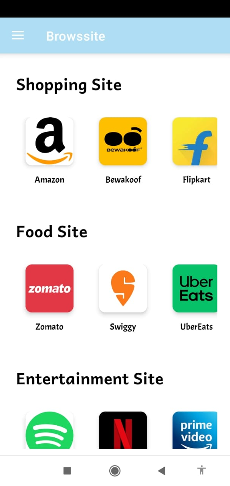
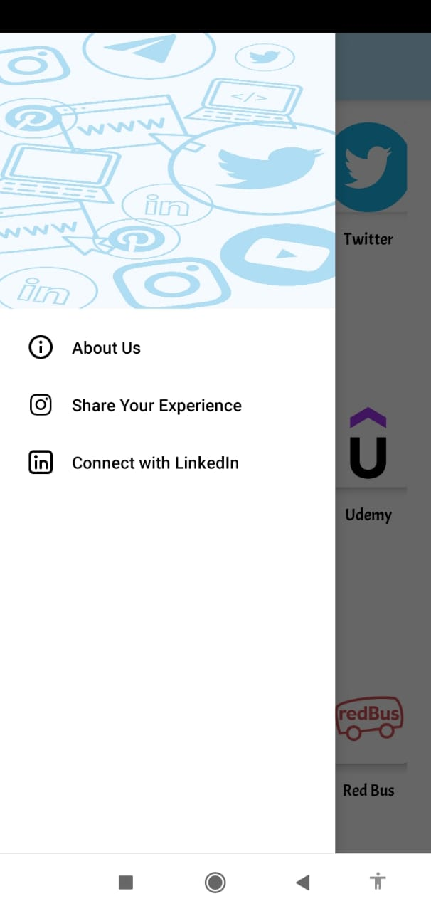
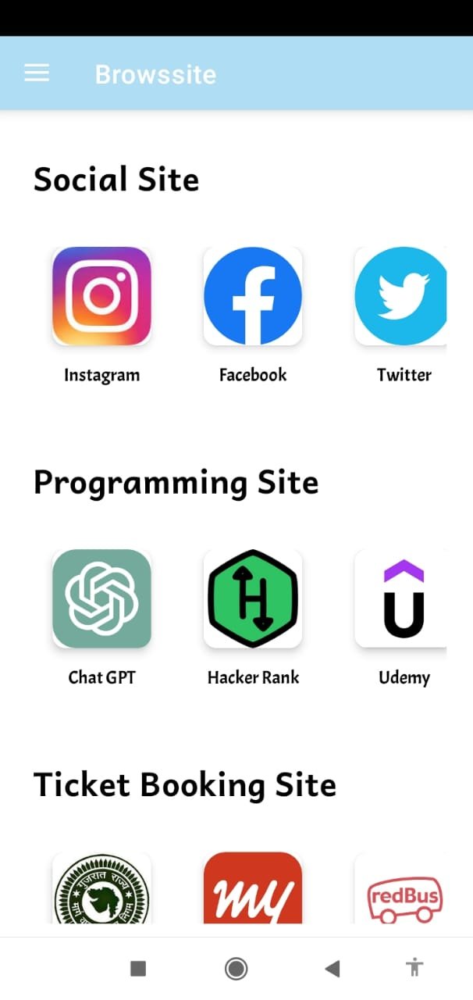
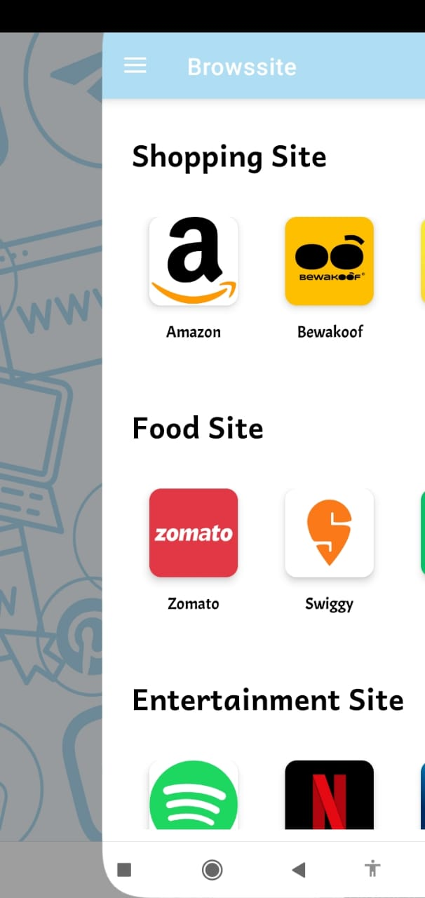

# 🌐 Browssite  

Browssite is a lightweight and user-friendly **mobile browsing app** that brings all your favorite websites into one place. Whether it’s **shopping, food delivery, social media, entertainment, programming, or ticket booking**, Browssite makes navigation simple and fast with a clean design.  

---

## ✨ Features  
- 📱 **All-in-one browser** – Access shopping, food, entertainment, social, programming, and ticket booking sites in one app.  
- ⚡ **Lightweight & Fast** – Smooth performance with a simple UI.  
- 🔒 **Secure & Safe** – Focused on privacy while browsing.  
- 🎨 **Minimal UI** – Easy navigation for better user experience.  
- 🛠 **Quick Access** – Tap and directly open popular apps/sites like Amazon, Flipkart, Zomato, Instagram, Netflix, and more.  

---

## 📸 Screenshots  

| Home | Menu | Categories |
|------|------|-------------|
|  |  |  |  | 

---

## 🚀 Installation  

1. Download the latest **APK** from [Releases](../../releases).  
2. Install the APK on your Android device.  
3. Open the app and start browsing 🚀.  

---

## 🛠 Tech Stack  
- **Platform:** Android  
- **Language:** Java/Kotlin  
- **UI:** XML + Material Design  

---

## 📬 Connect  
If you like this project, feel free to ⭐ star the repo or connect with me on [LinkedIn](https://www.linkedin.com).  
